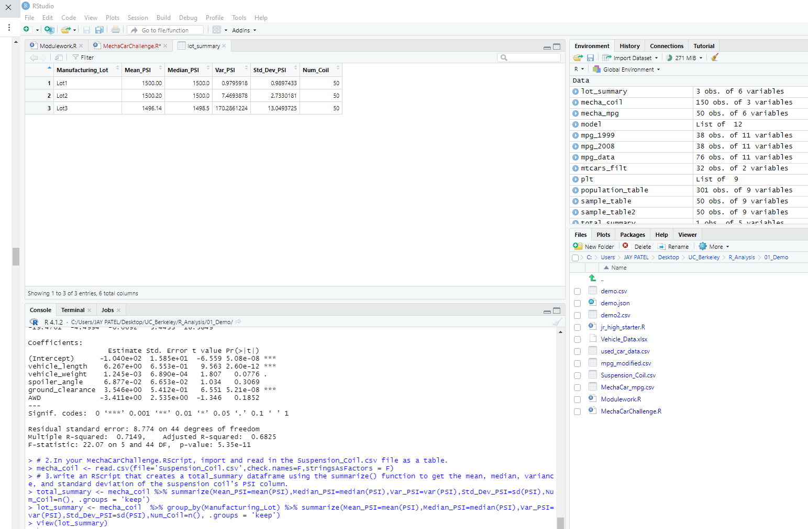
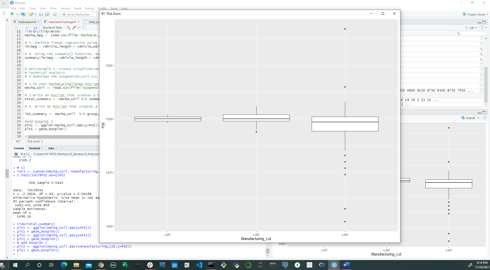
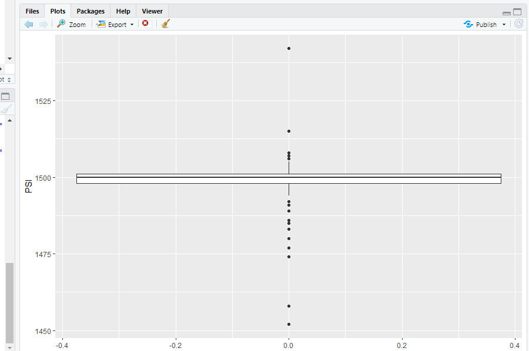
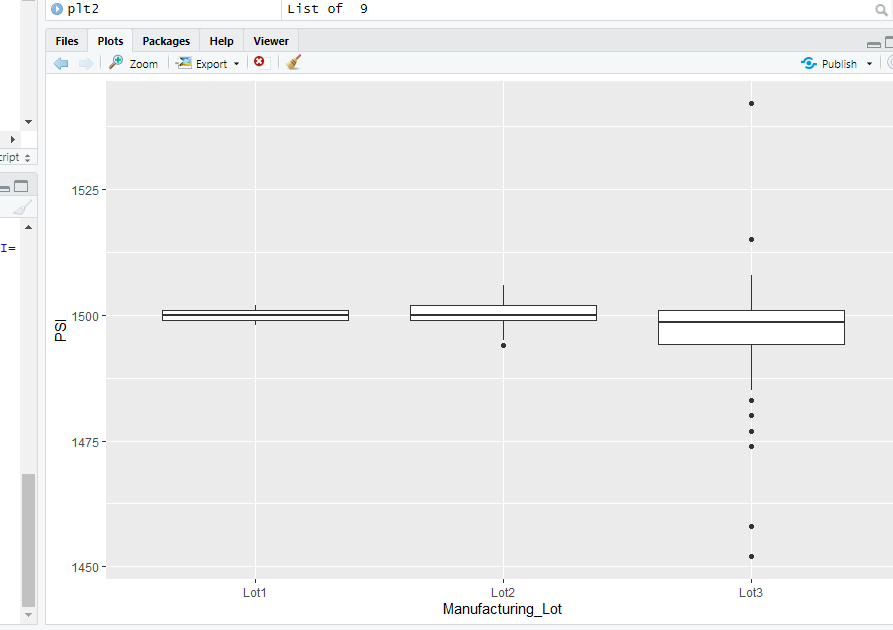

## Project: MechaCar Statistical Analysis

Project Owner: VP MechaCar- Division AutoRu( Prototype Div of MechaCar)

Project Manager: Nayan patel

Scope: MechaCar, is suffering from production troubles that are blocking the manufacturing team’s progress. AutosRUs’ upper management has called on Nayan Patel and the data analytics team to review the production data for insights that may help the manufacturing team.

## Deliverables:

Deliverable 1: Linear Regression to Predict MPG

Deliverable 2: Summary Statistics on Suspension Coils

Deliverable 3: T-Test on Suspension Coils

Deliverable 4: Design a Study Comparing the MechaCar to the Competition

Results:

## Deliverable 1:

Technical Analysis and requirements: Using library dplyr and tydyverse perfoming linear regression to determinve p value and the r-squared value.

## Creating Linear Regression to Predict MPG

Using RScriptPerform linear regression using the lm() function. In the lm() function, pass in all six variables (i.e., columns), and add the dataframe you created in Step 4 as the data parameter.

lm(mpg ~ vehicle_length + vehicle_weight + spoiler_angle + ground_clearance + AWD, data=mecha_mpg)

Results running RScript for linear regression:

Call:
lm(formula = mpg ~ vehicle_length + vehicle_weight + spoiler_angle + 
    ground_clearance + AWD, data = mecha_mpg)

Coefficients:
     (Intercept)    vehicle_length    vehicle_weight     spoiler_angle  ground_clearance               AWD  
      -1.040e+02         6.267e+00         1.245e-03         6.877e-02         3.546e+00        -3.411e+00  

Using the summary() function, determine the p-value and the r-squared value for the linear regression model.

summary(lm(mpg ~ vehicle_length + vehicle_weight + spoiler_angle + ground_clearance + AWD, data=mecha_mpg)) 

Call:
lm(formula = mpg ~ vehicle_length + vehicle_weight + spoiler_angle + 
    ground_clearance + AWD, data = mecha_mpg)

Residuals:
     Min       1Q   Median       3Q      Max 
-19.4701  -4.4994  -0.0692   5.4433  18.5849 

Coefficients:
                   Estimate Std. Error t value Pr(>|t|)    
(Intercept)      -1.040e+02  1.585e+01  -6.559 5.08e-08 ***
vehicle_length    6.267e+00  6.553e-01   9.563 2.60e-12 ***
vehicle_weight    1.245e-03  6.890e-04   1.807   0.0776 .  
spoiler_angle     6.877e-02  6.653e-02   1.034   0.3069    
ground_clearance  3.546e+00  5.412e-01   6.551 5.21e-08 ***
AWD              -3.411e+00  2.535e+00  -1.346   0.1852    
---
Signif. codes:  0 ‘***’ 0.001 ‘**’ 0.01 ‘*’ 0.05 ‘.’ 0.1 ‘ ’ 1

Residual standard error: 8.774 on 44 degrees of freedom
Multiple R-squared:  0.7149,	Adjusted R-squared:  0.6825 
F-statistic: 22.07 on 5 and 44 DF,  p-value: 5.35e-11

## Summary Deliverable 1:

a) The p-Value for this model, p-Value(5.35e-11), is smaller than the assumed significance level of 0.05%. This indicates there is sufficient evidence to reject our null hypothesis, which further indcates that the slope of this linear model is not zero.

b) This regression model has an Multiple R-squared value of 0.7149, which means that approximately 71% of all mpg predictions will be determined by this model. This multiple regression model does predict mpg of MechaCar prototypes effectively.

images:

## Deliverable 2:

Technical Analysis and requirements:

The design specifications for the MechaCar suspension coils dictate that the variance of the suspension coils must not exceed 100 pounds per square inch. Does the current manufacturing data meet this design specification for all manufacturing lots in total and each lot individually? Why or why not?d1

## Create Visualizations for the Trip Analysis

import and read in the Suspension_Coil.csv file as a table.

mecha_coil <- read.csv(file='Suspension_Coil.csv',check.names=F,stringsAsFactors = F)

RScript that creates a total_summary dataframe using the summarize() function to get the mean, median, variance, and standard deviation of the suspension coil’s PSI column.

total_summary <- mecha_coil %>% summarize(Mean_PSI=mean(PSI),Median_PSI=median(PSI),Var_PSI=var(PSI),Std_Dev_PSI=sd(PSI), .groups = 'keep') 

RScript that creates a lot_summary dataframe using the group_by() and the summarize() functions to group each manufacturing lot by the mean, median, variance, and standard deviation of the suspension coil’s PSI column.

lot_summary <- mecha_coil  %>% group_by(Manufacturing_Lot) %>% summarize(Mean_PSI=mean(PSI),Median_PSI=median(PSI),Var_PSI=var(PSI),Std_Dev_PSI=sd(PSI),.groups = 'keep')

#add boxplot 1

plt1 <- ggplot(mecha_coil,aes(y=PSI))
plt1 + geom_boxplot() 

# add boxplot 2

plt2 <- ggplot(mecha_coil,aes(x=Manufacturing_Lot,y=PSI))
plt2 + geom_boxplot()

Images:

Summary:

variance of the suspension coils cannot exceed 100 pounds per square inch (PSI). and came at is 62.29 PSI, which is within the 100 PSI variance requirement.

Lot 1: with variances of 0.98 

Lot 2 Also within the 100 PSI variance requirement

Lot 3 has variance of 170.29 that is above threshold by creating higher varience

## Deliverable 3:

Technical Analysis and requirements:Deliverable Requirements:

Performing t-tests to determine if all manufacturing lots and each lot individually are statistically different from the population mean of 1,500 pounds per square inch.

1. RScript using the t.test() function to determine if the PSI across all manufacturing lots is statistically different from the population mean of 1,500 pounds per square inch.
t.test(mecha_coil$PSI,mu=1500)

2. RScript using the t.test() function and its subset() argument to determine if the PSI for each manufacturing lot is statistically different from the population mean of 1,500 pounds per square inch.

a)
lot1 <- subset(mecha_coil, Manufacturing_Lot=="Lot1")
t.test(lot1$PSI,mu=1500)

b) 
lot2 <- subset(mecha_coil, Manufacturing_Lot=="Lot2")
t.test(lot2$PSI,mu=1500)

c)
lot3 <- subset(mecha_coil, Manufacturing_Lot=="Lot3")
t.test(lot3$PSI,mu=1500)

Summary:

True mean of the sample is 1498.78 With a p-Value of 0.06, which is higher than the common significance level of 0.05

So NO enough evidence to support rejecting the null hypothesis.

The mean of all three of these manufacturing lots is statistically similar to the presumed population mean of 1500.

Next looking at each individual lots:

Lot 1 Results:

One Sample t-test

data:  mecha_coil$PSI
t = -1.8931, df = 149, p-value = 0.06028
alternative hypothesis: true mean is not equal to 1500
95 percent confidence interval:
 1497.507 1500.053
sample estimates:
mean of x 
  1498.78 

Lot 2 Results:

One Sample t-test

data:  lot2$PSI
t = 0.51745, df = 49, p-value = 0.6072
alternative hypothesis: true mean is not equal to 1500
95 percent confidence interval:
 1499.423 1500.977
sample estimates:
mean of x 
   1500.2
 
lot 3 Results:  

ne Sample t-test

data:  lot3$PSI
t = -2.0916, df = 49, p-value = 0.04168
alternative hypothesis: true mean is not equal to 1500
95 percent confidence interval:
 1492.431 1499.849
sample estimates:
mean of x 
  1496.14 
 
## Deliverable 4:

Technical Analysis and requirements:Deliverable Requirements:

design a statistical study to compare performance of the MechaCar vehicles against performance of vehicles from other manufacturers.

Statistical study design:

Metrics to be tested against competition:

Body shell: forms the skeleton of the vehicle.

Engine: power train unit of the vehicle; which in the past has been in large part, the internal combustion engine.

Transmission system: aids in transferring the drive from the engine to the wheels. Its main components are the clutch, gearbox, final drive, and differential.

Suspension system: used to connect the wheels to the body or chassis frame.

Steering system

Brakes

Electrical equipment

Interior: dashboard, door panels, headliner, seats, etc.

null hypothesis(H0) or an alternative hypothesis(Ha) is a statistical test  to see how we are standing agianst competition in this studay case.

Study involves collecting data on MechaCar and its comparable models across several different manufacturers over the past few years.

Results:
H0(null Hypothisis) MechaCar is priced correctly based on its performance of key factors for its style design.

Ha(Alternative Hypothesis): MechaCar is NOT priced correctly based on performance of key factors for its style design.
Statistical Tests

We can use linear regression method using RScript and can finds results for differnet technical requiremnts

